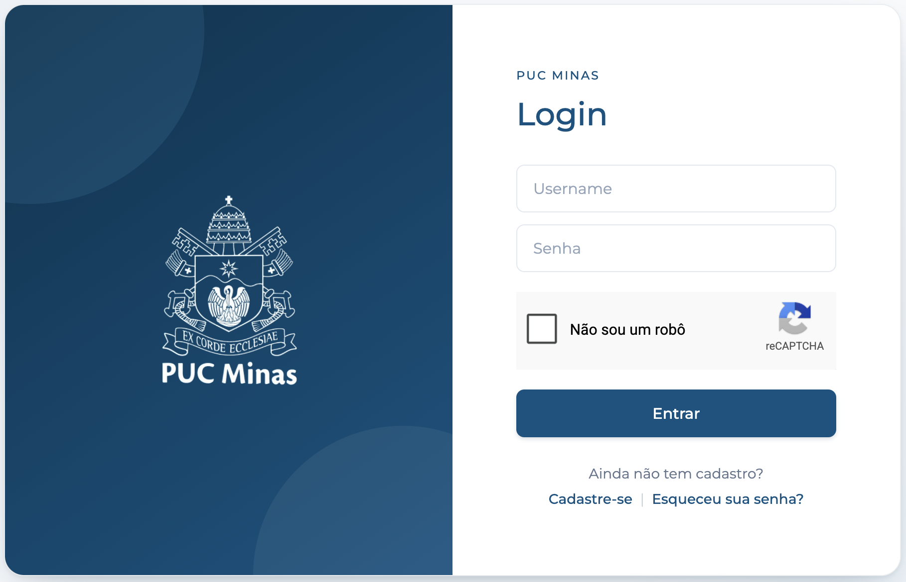
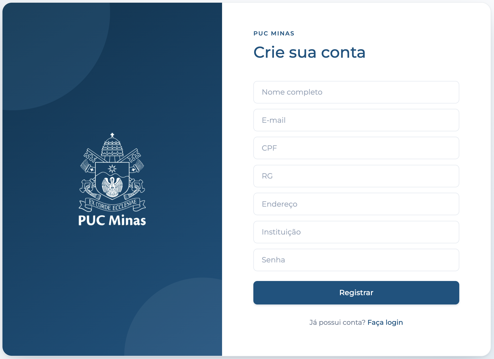
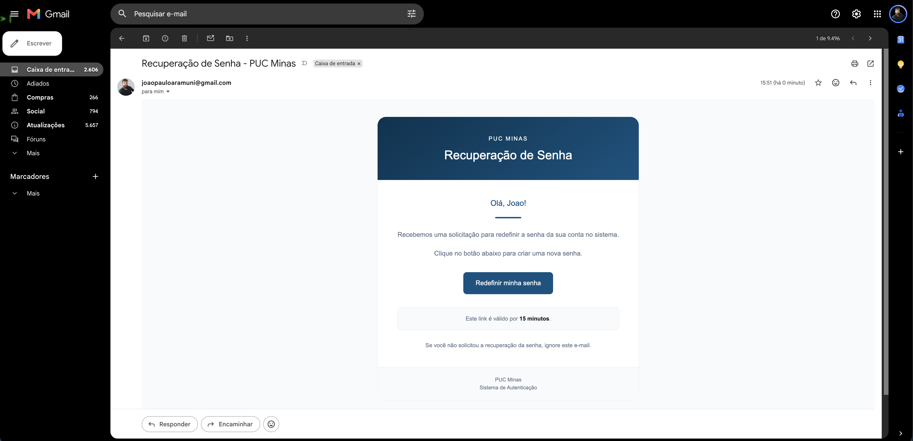

# Projeto TelaLogin

## Descrição
O TelaLogin é um projeto de aplicação web que implementa um sistema de login seguro utilizando Spring Boot e Spring Security. O objetivo é permitir a autenticação de usuários, diferenciando entre usuários comuns e administradores, e garantindo o acesso apropriado às páginas da aplicação.

## Estrutura do Projeto

```text
📁 TelaLogin
│
├── 📁 src
│   └── 📁 main
│       │
│       ├── ☕ java
│       │   └── 📦 com.example.TelaLogin
│       │       │
│       │       ├── 🚀 application
│       │       │   └── TelaLoginApplication.java
│       │       │       └── Classe principal da aplicação Spring Boot
│       │       │
│       │       ├── 🔐 config
│       │       │   ├── SecurityConfig.java
│       │       │   │   └── Configurações do Spring Security
│       │       │   │
│       │       │   ├── UserConfig.java
│       │       │   │   └── Configuração dos usuários e chaves do reCAPTCHA
│       │       │   │
│       │       │   └── RecaptchaFilter.java
│       │       │       └── Filtro responsável pela validação do reCAPTCHA
│       │       │
│       │       ├── 🎮 controller
│       │       │   └── SecureLoginController.java
│       │       │       └── Controladores e rotas da aplicação
│       │       │
│       │       ├── ⚠️ exception
│       │       │   ├── GlobalExceptionHandler.java
│       │       │   │   └── Tratamento global de exceções
│       │       │   │
│       │       │   └── SendEmailException.java
│       │       │       └── Exceção relacionada ao envio de e-mails
│       │       │
│       │       └── ⚙️ service
│       │           ├── SendEmailService.java
│       │           │   └── Serviço responsável pelo envio de e-mails
│       │           │
│       │           ├── UserService.java
│       │           │   └── Serviço responsável pelo gerenciamento dos usuários
│       │           │
│       │           ├── PasswordRecoveryService.java
│       │           │   └── Serviço responsável pela recuperação de senha
│       │           │
│       │           └── RecaptchaService.java
│       │               └── Serviço responsável pela validação do Google reCAPTCHA
│       │
│       └── 📁 resources
│           │
│           ├── ⚙️ application.properties
│           │   └── Configurações da aplicação, e-mail e reCAPTCHA
│           │
│           ├── 🎨 static
│           │   │
│           │   ├── 🎨 css
│           │   │   ├── admin.css
│           │   │   ├── error.css
│           │   │   ├── home.css
│           │   │   ├── login.css
│           │   │   ├── recoverpassword.css
│           │   │   ├── register.css
│           │   │   └── resetpassword.css
│           │   │       └── Arquivos de estilização das páginas
│           │   │
│           │   └── 🖼️ images
│           │       └── teste.png
│           │           └── Imagens utilizadas pela aplicação
│           │
│           └── 🌐 templates
│               │
│               ├── 📁 login
│               │   ├── login.html
│               │   │   └── Página de login com Google reCAPTCHA
│               │   │
│               │   ├── register.html
│               │   │   └── Página de cadastro de usuários
│               │   │
│               │   ├── recoverpassword.html
│               │   │   └── Página de recuperação de senha
│               │   │
│               │   ├── resetpassword.html
│               │   │   └── Página para redefinição da senha
│               │   │
│               │   └── error.html
│               │       └── Página apresentada quando ocorre um erro
│               │
│               ├── 📁 admin
│               │   └── admin.html
│               │       └── Página da área administrativa
│               │
│               └── 📁 user
│                   └── home.html
│                       └── Página inicial após autenticação
│
├── 🔒 .env
│   └── Credenciais reais (Gmail e reCAPTCHA), não versionado
│
├── 📄 .env.example
│   └── Modelo do .env, sem valores sensíveis
│
├── 🚫 .gitignore
│   └── Arquivos e pastas ignorados pelo Git (.env, target/, etc.)
│
└── 📄 pom.xml
    └── Dependências e configurações do Maven
```

## Organização dos templates

Os templates HTML foram agrupados em subpastas de acordo com sua área na aplicação, e os nomes das views retornadas pelo `SecureLoginController` foram atualizados de acordo:

| View                     | Caminho do template                  |
|--------------------------|---------------------------------------|
| `login/login`            | `templates/login/login.html`          |
| `login/register`         | `templates/login/register.html`       |
| `login/recoverpassword`  | `templates/login/recoverpassword.html`|
| `login/resetpassword`    | `templates/login/resetpassword.html`  |
| `login/error`            | `templates/login/error.html`          |
| `admin/admin`            | `templates/admin/admin.html`          |
| `user/home`              | `templates/user/home.html`            |

As rotas (URLs) da aplicação **não foram alteradas** — apenas os nomes internos das views/templates.

## Configuração do application.properties

As credenciais sensíveis (Gmail e Google reCAPTCHA) **não ficam mais hardcoded** no `application.properties`. Elas são lidas a partir de variáveis de ambiente, carregadas automaticamente de um arquivo `.env` na raiz do projeto (via a dependência [`spring-dotenv`](https://github.com/paulschwarz/spring-dotenv)).

```properties
spring.application.name=TelaLogin
app.user.username=leo.euricobete@gmail.com
app.user.password=4321
app.user.name=Leo
app.admin.username=admin
app.admin.password=1234
app.admin.name=Administrador
spring.mail.host=smtp.gmail.com
spring.mail.port=587
spring.mail.username=${MAIL_USERNAME}
spring.mail.password=${MAIL_PASSWORD}
spring.mail.properties.mail.smtp.auth=true
spring.mail.properties.mail.smtp.starttls.enable=true
spring.mail.properties.mail.smtp.starttls.required=true
recaptcha.site-key=${RECAPTCHA_SITE_KEY}
recaptcha.secret-key=${RECAPTCHA_SECRET_KEY}
```

### Arquivo .env

Crie um arquivo `.env` na raiz do projeto (um modelo está disponível em `.env.example`) com o seguinte conteúdo:

```env
# https://myaccount.google.com/apppasswords
MAIL_USERNAME=seu-email@gmail.com
MAIL_PASSWORD=sua-senha-de-app

# https://www.google.com/recaptcha/admin
RECAPTCHA_SITE_KEY=sua-site-key
RECAPTCHA_SECRET_KEY=sua-secret-key
```

O arquivo `.env` está listado no `.gitignore` e **não deve ser versionado**, já que contém credenciais reais. Para configurar o envio de e-mail é necessário ativar a autenticação de dois fatores na conta do Gmail e gerar uma senha de app.

## Dependências
```xml
<!-- Dependência do Spring Boot Test -->
<dependency>
    <groupId>org.springframework.boot</groupId>
    <artifactId>spring-boot-starter-test</artifactId>
    <scope>test</scope>
</dependency>

<!-- Dependência do Spring Security -->
<dependency>
    <groupId>org.springframework.boot</groupId>
    <artifactId>spring-boot-starter-security</artifactId>
</dependency>

<!-- Dependência do Thymeleaf para o Spring Boot -->
<dependency>
    <groupId>org.springframework.boot</groupId>
    <artifactId>spring-boot-starter-thymeleaf</artifactId>
</dependency>

<!-- Dependência do Spring Mail para o envio de email -->
<dependency>
    <groupId>org.springframework.boot</groupId>
    <artifactId>spring-boot-starter-mail</artifactId>
</dependency>

<!-- Dependência para carregar variáveis do arquivo .env -->
<dependency>
    <groupId>me.paulschwarz</groupId>
    <artifactId>spring-dotenv</artifactId>
    <version>4.0.0</version>
</dependency>

```

# Thymeleaf

Thymeleaf é um motor de templates para Java que permite a criação de páginas HTML dinâmicas de forma simples e eficiente. Ele é frequentemente utilizado em aplicações Spring, proporcionando uma maneira intuitiva de gerar conteúdo HTML e manipular dados diretamente nas páginas.

## Principais Características

- **Natural Templating**: Os templates Thymeleaf são válidos como documentos HTML, permitindo que sejam visualizados em navegadores sem processamento.
- **Integração com Spring**: Thymeleaf se integra perfeitamente com o Spring Framework, facilitando a injeção de dependências e o acesso a beans do Spring.
- **Expressões de Template**: Utiliza uma sintaxe simples e expressiva para manipular dados, permitindo a criação de lógicas condicionais e loops diretamente nas páginas.

## Exemplo de Uso

Aqui está um exemplo simples de um template Thymeleaf:

```html
<!DOCTYPE html>
<html xmlns:th="http://www.thymeleaf.org">
<head>
    <title>Exemplo Thymeleaf</title>
</head>
<body>
    <h1 th:text="${titulo}">Título do Documento</h1>
    <ul>
        <li th:each="item : ${itens}" th:text="${item}"></li>
    </ul>
</body>
</html>
```

Neste exemplo, o título e a lista de itens são preenchidos dinamicamente com dados fornecidos pelo controlador Spring.

Thymeleaf é uma escolha poderosa para desenvolvedores que desejam criar interfaces web dinâmicas e interativas em aplicações Java. Com sua sintaxe intuitiva e forte integração com o Spring, ele se tornou uma ferramenta popular no ecossistema de desenvolvimento Java.

## Interface Gráfica

A interface gráfica permite ao usuário inserir seus dados de login e, após a autenticação, ser redirecionado para a página correspondente, onde terá acesso às funcionalidades e informações de acordo com suas credenciais.

### Captura de Tela

- **Login**: A página de login possui campos para inserir o nome de usuário e a senha. Ela também exibe o logo da aplicação, proporcionando uma identificação visual clara. Abaixo do formulário de login, existem links para os usuários que ainda não possuem cadastro, direcionando-os para a página de registro, e para aqueles que esqueceram a senha, levando-os à página de recuperação de senha.

- **Register**: A página de registro permite que novos usuários criem uma conta na plataforma. Ela inclui campos para inserir **nome completo, e-mail, CPF, RG, endereço, instituição e senha**, garantindo que todas as informações necessárias para cadastro sejam coletadas. A lateral exibe o **logo da aplicação**, mantendo a identidade visual do sistema. Abaixo do formulário, há um link para os usuários que já possuem conta, direcionando-os de volta para a página de login.

|  |
|:----------------------------------------------------:|
|                        Login                         |

|  |
|:-------------------------------------------------------:|
|                        Register                         |

|  |
|:---------------------------------------------------------------:|
|                        Recover Password                         |

## Métodos da Classe SecurityConfig

### @Configuration
Indica que a classe contém métodos de configuração que geram beans para o contexto da aplicação.

### @EnableWebSecurity
Ativa a segurança da web, permitindo a configuração de regras de segurança para as URLs da aplicação.

### public SecurityFilterChain securityFilterChain(HttpSecurity http) throws Exception
Configura as regras de segurança das requisições HTTP, permitindo o acesso público às páginas de login e arquivos CSS, restringindo o acesso às páginas do administrador.

### public UserDetailsService userDetailsService()
Configura o gerenciamento de usuários em memória, criando um usuário comum e um administrador, codificando as senhas.

### public PasswordEncoder passwordEncoder()
Define o codificador de senhas a ser utilizado na aplicação, utilizando o BCryptPasswordEncoder.

## Urls do projeto:
http://localhost:8080/login

http://localhost:8080/login?logout=true

http://localhost:8080/home

http://localhost:8080/admin

http://localhost:8080/error

http://localhost:8080/register

http://localhost:8080/recoverpassword

## Licença
Este projeto está licenciado sob a MIT License.
